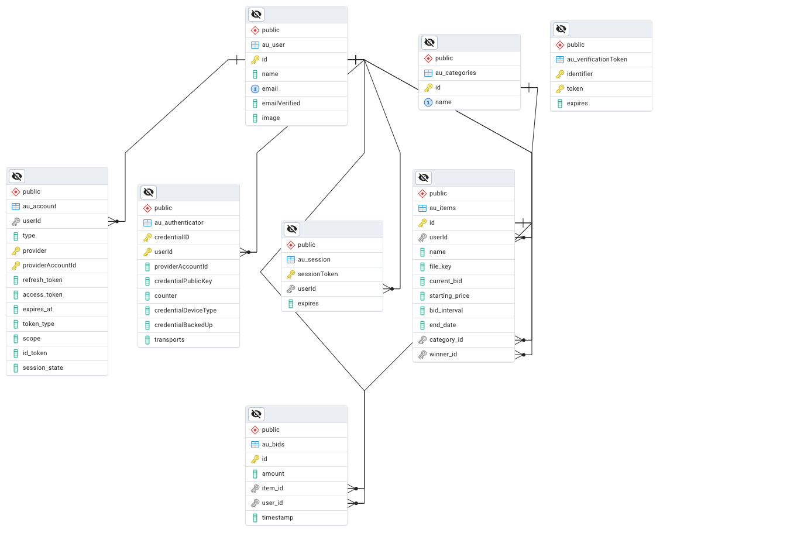

# Online Auction Platform

This is an online auction platform built with **Next.js**. Users can post items, place bids, and receive notifications when they are outbid. The backend is powered by PostgreSQL, with a smooth integration of **Drizzle ORM** and a polished frontend using **ShadCN UI**. User authentication is handled via **auth.js**, and notifications are sent using **Knock**. Item photos are stored in **Cloudflare R2 Bucket**.

## 🚀 Getting Started

### 1. Run the Docker container for the database:

docker compose up

### 2. Run the development server:

```bash
npm run dev
```

or

```bash
yarn dev
```

### 3. Run the maintenance script (to update the auction when the end time comes):

```bash
npx tsx -r dotenv/config scripts/mark_winners.ts
```

### 4. Open the application in your browser:

http://localhost:3000

## 🌟 Project Overview

An online auction platform where users can:

-   Post items with a title, starting price, bid interval, and end date.
-   Attach pictures to auction listings.
-   Bid on items and receive notifications if they are outbid.
-   View active auctions and their history.

## 🔧 Architecture

The project is built using the following technologies:

-   **Frontend:** [Next.js](https://nextjs.org) with **React** and pre-styled UI components from **ShadCN UI**.
-   **Backend:** API routes in Next.js with **Drizzle ORM** to interact with a **PostgreSQL database**.
-   **Authentication:** User login via **auth.js** with Google account integration.
-   **Cloud Storage:** Item photos are stored in **Cloudflare R2 Bucket**.
-   **Notifications:** Users are notified through **Knock** when they are outbid.

### Architecture Diagram:

User (Browser/Client) <--> Frontend (Next.js (React) ShadCN/UI) <--> Backend (API routes Drizzle ORM) <--> PostgreSQL DB

## 🧑‍💻 User Journey (UI descr)

### Registration

1. Click on the **Sign In** button in the top-right corner.
2. Log in with a Google account.
3. Sign out and choose a different account if necessary.

### Choosing an Auction

1. On the **Home (All Auctions)** page, browse through the list of all auctions.
2. Select an auction to either place a bid or view the bid history (if the auction is over).

### Bidding

1. On the **Item Page**, view the list of bids.
2. Click **Place a Bid** to place your own bid (calculated as the last bid + bid interval).
3. An in-app notification is sent to all previous bidders informing them they were outbid.

### Creating an Auction

1. Click **Create Auction** in the header.
2. Fill out the auction details, including item name, starting price, bid interval, and auction end date.
3. Attach a photo of the item and click **Post Item** to add it to the list of active auctions.

### Viewing Your Auctions

1. Click **My Auctions** in the header to view the items you've posted for auction.

### Viewing Won Auctions

1. Click **Won Auctions** in the header to see a list of auctions you've won (i.e., where you placed the highest bid).

## 📄 XML

You can view the full [technical specification](tech_spec.xml).

## 📊 Database Schema

View the **Database Entity Relationship Diagram** (ERD) below:


